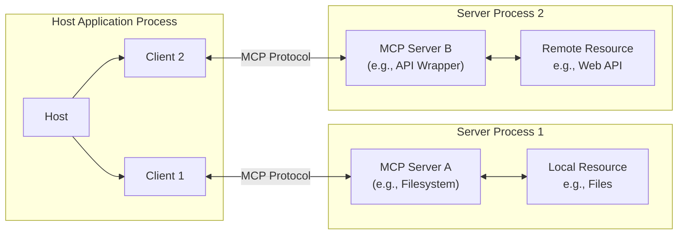

# pubmed-mcp-server: Developer Guide & MCP Standards

Effective Date: 2025-05-24

This document mandates development practices, configuration, and operational procedures for the `pubmed-mcp-server`. It aligns with the Model Context Protocol (MCP) Specification 2025-03-26.

## I. Server Configuration & Operation

### A. Environment Variables (Mandatory & Optional)

Server behavior is dictated by environment variables. Refer to `src/config/index.ts` for comprehensive loading logic.

**Core Transport & Server Behavior:**

- **`MCP_TRANSPORT_TYPE`**: Transport mechanism.
  - `"stdio"` (Default): Standard I/O.
  - `"http"`: Streamable HTTP SSE. **Recommended for `pubmed-mcp-server`**.
- **`MCP_HTTP_PORT`**: HTTP server port (Default: `3010`). Applies if `MCP_TRANSPORT_TYPE=http`.
- **`MCP_HTTP_HOST`**: HTTP server host (Default: `127.0.0.1`). Applies if `MCP_TRANSPORT_TYPE=http`.
- **`MCP_ALLOWED_ORIGINS`**: Comma-separated list of allowed origins for HTTP CORS (e.g., `http://localhost:3000,https://your.app.com`). Applies if `MCP_TRANSPORT_TYPE=http`.
- **`MCP_LOG_LEVEL`**: Minimum logging severity (e.g., `"debug"`, `"info"`, `"warn"`, `"error"`). Default: `"debug"`.
- **`LOGS_DIR`**: Directory for log file storage (Default: `logs/` in project root).
- **`MCP_AUTH_SECRET_KEY`**: **MANDATORY for `http` transport.** Minimum 32-character secret key for JWT signing and verification. **MUST be securely generated and set in production.**

**PubMed Specific (NCBI E-utilities Integration):**

- **`NCBI_API_KEY`**: Your NCBI API Key. Essential for higher rate limits and reliable access.
- **`NCBI_TOOL_IDENTIFIER`**: `tool` parameter value for NCBI E-utility requests (e.g., `@cyanheads/pubmed-mcp-server/1.0.13`). Defaults to `@cyanheads/pubmed-mcp-server/<package.json version>`.
- **`NCBI_ADMIN_EMAIL`**: `email` parameter value for NCBI E-utility requests (your administrative contact email).
- **`NCBI_REQUEST_DELAY_MS`**: Milliseconds to wait between NCBI requests (e.g., `100` with API key, `334` without). Governs `ncbiRequestQueueManager.ts`.
- **`NCBI_MAX_RETRIES`**: Maximum number of retries for failed NCBI requests.

**Optional LLM Provider Configuration (If server uses LLMs internally):**

- `OPENROUTER_API_KEY`, `OPENROUTER_APP_URL`, `OPENROUTER_APP_NAME`
- `LLM_DEFAULT_MODEL`, `LLM_DEFAULT_TEMPERATURE`, `LLM_DEFAULT_TOP_P`, `LLM_DEFAULT_MAX_TOKENS`, `LLM_DEFAULT_TOP_K`, `LLM_DEFAULT_MIN_P`
- `GEMINI_API_KEY`

**Optional OAuth Proxy Configuration:**

- `OAUTH_PROXY_AUTHORIZATION_URL`, `OAUTH_PROXY_TOKEN_URL`, `OAUTH_PROXY_REVOCATION_URL`, `OAUTH_PROXY_ISSUER_URL`, `OAUTH_PROXY_SERVICE_DOCUMENTATION_URL`, `OAUTH_PROXY_DEFAULT_CLIENT_REDIRECT_URIS`

### B. HTTP Transport Details (`MCP_TRANSPORT_TYPE=http`)

- **Endpoint**: A single endpoint, `/mcp`, handles all MCP communication.
  - `POST /mcp`: Client sends requests/notifications. Requires `mcp-session-id` header after initialization. Server responds with JSON or initiates an SSE stream.
  - `GET /mcp`: Client initiates an SSE stream for server-sent messages. Requires `mcp-session-id` header.
  - `DELETE /mcp`: Client signals session termination. Requires `mcp-session-id` header.
- **Session Management**: Each client connection establishes a session identified by the `mcp-session-id` HTTP header. The server maintains state per session.
- **Security**: Robust origin checking is implemented via `isOriginAllowed` in `src/mcp-server/transports/httpTransport.ts`. Configure `MCP_ALLOWED_ORIGINS` for production. JWT authentication is enforced by `src/mcp-server/transports/authentication/authMiddleware.ts` using `MCP_AUTH_SECRET_KEY`.

### C. Server Execution Commands

- **Format Code**: `npm run format`
- **Build Project**: `npm run build`
- **Run (Stdio Transport)**: `npm run start:stdio`
- **Run (HTTP Transport)**: `npm run start:http` (Ensure `MCP_AUTH_SECRET_KEY`, `NCBI_API_KEY`, `NCBI_ADMIN_EMAIL` are correctly set in the environment).

## II. Model Context Protocol (MCP) Overview (Spec: 2025-03-26)

MCP provides a standardized interface for LLMs (via host applications) to interact with external capabilities (tools, data) exposed by dedicated servers.

### A. Core Concepts & Architecture

- **Host:** Manages clients, LLM integration, security, and user consent (e.g., Claude Desktop, VS Code).
- **Client:** Resides in the host, connects 1:1 to a server, handles protocol.
- **Server:** Standalone process exposing capabilities (Resources, Tools, Prompts). Focuses on its domain, isolated from LLM/other servers.



- **Key Principles:** Simplicity, Composability, Isolation, Progressive Features.

### B. Protocol Basics

- **Communication:** JSON-RPC 2.0 over a transport (Stdio, Streamable HTTP).
- **Messages:** Requests (with `id`), Responses (`id` + `result`/`error`), Notifications (no `id`). Batches MUST be supported for receiving.
- **Lifecycle:**
  1.  **Initialization:** Client sends `initialize` (version, capabilities, clientInfo). Server responds (`initialize` response: agreed version, capabilities, serverInfo, instructions?). Client sends `initialized` notification.
  2.  **Operation:** Message exchange based on negotiated capabilities.
  3.  **Shutdown:** Transport disconnect.

### C. Server Capabilities

Servers expose functionality via:

1.  **Resources:**

    - **Purpose:** Expose data/content (files, DB records) as context. Application-controlled.
    - **ID:** Unique URI (e.g., `file:///path/to/doc.txt`).
    - **Discovery:** `resources/list` (paginated), `resources/templates/list` (paginated).
    - **Reading:** `resources/read` -> `ResourceContent` array (`text` or `blob`).
    - **Updates (Optional):** `listChanged: true` -> `notifications/resources/list_changed`. `subscribe: true` -> `resources/subscribe`, `notifications/resources/updated`. **MUST handle `resources/unsubscribe` request.**

2.  **Tools:**

    - **Purpose:** Expose executable functions for LLM invocation (via client). Model-controlled.
    - **Definition:** `Tool` object (`name`, `description`, `inputSchema` (JSON Schema), `annotations?`). Annotations are untrusted hints.
    - **Discovery:** `tools/list` (paginated).
    - **Invocation:** `tools/call` (`name`, `arguments`) -> `CallToolResult` (`content` array, `isError: boolean`). Execution errors reported via `isError: true`. **Rich, well-described schemas are CRUCIAL.**
    - **Updates (Optional):** `listChanged: true` -> `notifications/tools/list_changed` (MUST send after dynamic changes).

3.  **Prompts:**
    - **Purpose:** Reusable prompt templates/workflows. User-controlled.
    - **Definition:** `Prompt` object (`name`, `description?`, `arguments?`).
    - **Discovery:** `prompts/list` (paginated).
    - **Usage:** `prompts/get` (`name`, `arguments`) -> `GetPromptResult` (`messages` array).
    - **Updates (Optional):** `listChanged: true` -> `notifications/prompts/list_changed`.

### D. Interacting with Client Capabilities

- **Roots:** Client may provide filesystem roots (`file://`). Server receives list on init, updates via `notifications/roots/list_changed`. Servers SHOULD respect roots.
- **Sampling:** Server can request LLM completion via `sampling/createMessage`. Client SHOULD implement human-in-the-loop.

### E. Server Utilities (Selected)

- **Logging:** `logging` capability -> `notifications/message` (RFC 5424 levels). Client can send `logging/setLevel`.
- **Pagination:** List operations use `cursor`/`nextCursor`.
- **Cancellation:** `notifications/cancelled` (best-effort).
- **Ping:** `ping` request -> `{}` response.

## III. MCP Tool Development: Authoritative Workflow (TypeScript SDK)

This section mandates the process for creating MCP tools. Adherence ensures consistency, reliability, and leverages SDK benefits.

### A. Foundational Structure

1.  **Directory Organization**: Each tool resides in `src/mcp-server/tools/yourToolName/`.
    - `index.ts`: Barrel export for the registration function.
    - `logic.ts`: Contains the Zod schema for input, the core tool logic (handler function), and related type definitions.
    - `registration.ts`: Implements the tool registration using `server.tool()`.

### B. Step 1: Define Input Schema and Types (`logic.ts`)

Utilize Zod for robust schema definition and input validation. The SDK uses this to generate the JSON Schema for client discovery and to validate arguments at runtime.

```typescript
// src/mcp-server/tools/yourToolName/logic.ts
import { z } from "zod";

// Define Zod schema for tool input
export const YourToolInputSchema = z.object({
  query: z.string().min(3).describe("The search query, minimum 3 characters."),
  maxResults: z
    .number()
    .int()
    .positive()
    .optional()
    .default(10)
    .describe("Maximum results to return."),
  filterActive: z
    .boolean()
    .optional()
    .default(true)
    .describe("Filter by active status."),
});

// Infer TypeScript type from Zod schema
export type YourToolInput = z.infer<typeof YourToolInputSchema>;
```

**Note:** Descriptions in Zod schemas are critical as they inform LLM tool selection.

### C. Step 2: Implement Core Tool Logic (`logic.ts`)

The handler function encapsulates the tool's execution.

- **Signature**: `async (validatedInput: YourInputType, context: RequestContext): Promise<CallToolResult>`
- **`validatedInput`**: SDK-provided, schema-validated input.
- **`context`**: `RequestContext` for logging, error propagation, and correlation.
- **Return**: A `CallToolResult` object.
  - Success: `{ content: [{ type: "text", text: JSON.stringify(output) }], isError: false }`
  - Failure: `{ content: [{ type: "text", text: JSON.stringify(errorOutput) }], isError: true }` (Use `McpError` for `errorOutput`).

```typescript
// src/mcp-server/tools/yourToolName/logic.ts
// ... (Zod schema from above)
import { CallToolResult } from "@modelcontextprotocol/sdk/types.js";
import {
  logger,
  RequestContext,
  requestContextService,
  sanitizeInputForLogging,
} from "../../../utils/index.js";
import { BaseErrorCode, McpError } from "../../../types-global/errors.js";
// import { yourExternalService } from "../../../services/yourService.js"; // Example service import

export async function yourToolLogic(
  input: YourToolInput,
  parentRequestContext: RequestContext,
): Promise<CallToolResult> {
  const operationContext = requestContextService.createRequestContext({
    parentRequestId: parentRequestContext.requestId,
    operation: "yourToolLogicExecution",
    input: sanitizeInputForLogging(input),
  });

  logger.info(
    `Executing 'yourToolName'. Query: ${input.query}`,
    operationContext,
  );

  try {
    // const serviceResult = await yourExternalService.fetchData(input.query, input.maxResults);
    // Simulate service call for example
    const serviceResult = Array.from(
      { length: Math.min(input.maxResults, 5) },
      (_, i) => ({
        id: `item-${i + 1}`,
        title: `Result for ${input.query} #${i + 1}`,
        isActive: input.filterActive,
      }),
    );

    const output = {
      toolName: "yourToolName",
      queryEcho: input.query,
      results: serviceResult,
      timestamp: new Date().toISOString(),
    };

    return {
      content: [{ type: "text", text: JSON.stringify(output) }],
      isError: false,
    };
  } catch (error: any) {
    logger.error(
      "Execution failed for 'yourToolName'",
      error,
      operationContext,
    );
    const mcpError =
      error instanceof McpError
        ? error
        : new McpError(
            BaseErrorCode.TOOL_EXECUTION_ERROR,
            `'yourToolName' failed: ${error.message || "Internal server error."}`,
            {
              originalErrorName: error.name,
              requestId: operationContext.requestId,
            },
          );
    return {
      content: [
        {
          type: "text",
          text: JSON.stringify({
            error: {
              code: mcpError.code,
              message: mcpError.message,
              details: mcpError.details,
            },
          }),
        },
      ],
      isError: true,
    };
  }
}
```

### D. Step 3: Register the Tool (`registration.ts`)

Use `server.tool()` to register the defined logic with the MCP server.

- **Parameters for `server.tool()`**:
  1.  `name: string`: Public, unique tool name (e.g., `"your_tool_name"`).
  2.  `description: string`: Detailed explanation for LLM discovery.
  3.  `zodSchemaShape`: **The `.shape` property of the Zod schema object** (e.g., `YourToolInputSchema.shape`).
  4.  `handler: async (validatedInput, mcpToolContext) => Promise<CallToolResult>`: The SDK wraps your logic function.

```typescript
// src/mcp-server/tools/yourToolName/registration.ts
import { McpServer } from "@modelcontextprotocol/sdk/server/mcp.js";
import { BaseErrorCode, McpError } from "../../../types-global/errors.js";
import {
  ErrorHandler,
  requestContextService,
  RequestContext,
} from "../../../utils/index.js";
import { YourToolInputSchema, yourToolLogic, YourToolInput } from "./logic.js";

export function registerYourTool(server: McpServer): void {
  const operation = "registerYourTool";
  const regContext = requestContextService.createRequestContext({ operation });

  try {
    server.tool(
      "your_tool_name",
      "Processes a query with optional filters and returns structured results. Demonstrates tool registration.",
      YourToolInputSchema.shape, // CRITICAL: Pass the .shape
      async (validatedInput: YourToolInput, mcpProvidedContext: any) => {
        const handlerRequestContext =
          requestContextService.createRequestContext({
            parentRequestId: regContext.requestId, // Optional: link to registration context
            operation: "yourToolNameHandler",
            mcpToolContext: mcpProvidedContext, // Context from MCP SDK during call
          });
        return yourToolLogic(validatedInput, handlerRequestContext);
      },
    );
    logger.notice(`Tool 'your_tool_name' registered.`, regContext);
  } catch (error) {
    ErrorHandler.handleError(
      new McpError(
        BaseErrorCode.INITIALIZATION_FAILED,
        `Failed to register 'your_tool_name'`,
        {
          /* details */
        },
      ),
      {
        operation,
        context: regContext,
        errorCode: BaseErrorCode.INITIALIZATION_FAILED,
        critical: true,
      },
    );
  }
}
```

### E. Step 4: Export Registration (`index.ts`)

```typescript
// src/mcp-server/tools/yourToolName/index.ts
export * from "./registration.js";
```

### F. Step 5: Integrate into Server Initialization (`src/mcp-server/server.ts`)

```typescript
// src/mcp-server/server.ts
// ... other imports ...
import { registerYourTool } from "./tools/yourToolName/index.js"; // Import new tool registration
// ...
export async function createMcpServerInstance(
  options: McpServerOptions,
  serverInitContext: RequestContext,
): Promise<McpServer> {
  // ...
  const server = new McpServer(options);
  // ... register other tools ...
  registerYourTool(server); // Register the new tool
  // ...
  return server;
}
```

### G. SDK Usage (TypeScript) - IMPORTANT Adherence Required

- **High-Level SDK Abstractions (MANDATORY):**
  - **Use `server.tool(name, description, zodSchemaShape, handler)`:** This is the **sole authorized method** for defining tools. It handles registration, schema generation, validation, routing, and `CallToolResult` formatting.
  - **Use `server.resource(regName, template, metadata, handler)`:** Similarly, this is the authorized method for resources.
- **Low-Level SDK Handlers (PROHIBITED for Tools/Resources):**
  - Direct use of `server.setRequestHandler(SchemaObject, handler)` for capabilities like tools or resources that have high-level SDK abstractions is **strictly prohibited**.
  - **CRITICAL WARNING:** Mixing high-level (`server.tool`, `server.resource`) and low-level (`server.setRequestHandler`) approaches for the _same capability type_ (e.g., tools) WILL lead to SDK internal state corruption, unpredictable errors, and non-compliant behavior. **No exceptions.**

## IV. Security Mandates

- **Input Validation**: Enforce strictly via Zod schemas. Sanitize all external inputs (paths, HTML, SQL queries) using `src/utils/security/sanitization.ts`.
- **Access Control**: Adhere to the principle of least privilege. Respect client-provided filesystem roots.
- **Transport Security**:
  - **HTTP**: JWT authentication is MANDATORY (`MCP_AUTH_SECRET_KEY`). Validate `Origin` header (`isOriginAllowed`). Deploy HTTPS in production. Bind to `127.0.0.1` for local-only servers.
  - **Stdio**: Authentication is typically managed by the host. Do not implement separate auth for stdio MCP server processes.
- **Secrets Management**: Use environment variables (`NCBI_API_KEY`, `MCP_AUTH_SECRET_KEY`) or a dedicated secrets manager. NEVER hardcode secrets.
- **Dependency Audits**: Regularly run `npm audit` and update dependencies.
- **Rate Limiting**: Implement server-side queuing and delays for external services like NCBI E-utilities (`NCBI_REQUEST_DELAY_MS`).

## V. JSDoc and Code Documentation Standards

- **Purpose**: JSDoc complements TypeScript, explaining purpose, behavior, and non-obvious considerations.
- **Standard Tags**: Use tags defined in `tsdoc.json` (e.g., `@fileoverview`, `@module`, `@param`, `@returns`, `@throws`, `@example`).
- **File Overview**: Start each file with a `@fileoverview` and `@module` JSDoc block.
- **Focus**: Explain the "why" and "how." Rely on TypeScript for type details; use JSDoc `@param`/`@returns` for additional clarification beyond types.
- **Conciseness**: Be brief and direct.
- **Formatting**: Adhere to Prettier (`npm run format`).

## VI. Core Project Utilities (Refer to `src/utils/`)

Integrate these utilities consistently:

1.  **Logging (`src/utils/internal/logger.ts`)**: Structured, RFC 5424 compliant.
    ```typescript
    import { logger, RequestContext } from "./utils/index.js";
    logger.info("Event details", context);
    logger.error("Failure details", errorInstance, context);
    ```
2.  **Error Handling (`src/types-global/errors.ts`, `src/utils/internal/errorHandler.ts`)**: `McpError`, `ErrorHandler.tryCatch`.
3.  **Request Context (`src/utils/internal/requestContext.ts`)**: `requestContextService.createRequestContext()`.
4.  **ID Generation (`src/utils/security/idGenerator.ts`)**: `idGenerator.generateForEntity()`, `generateUUID()`.
5.  **Sanitization (`src/utils/security/sanitization.ts`)**: `sanitization.sanitizeHtml()`, etc., `sanitizeInputForLogging()`.
6.  **JSON Parsing (`src/utils/parsing/jsonParser.ts`)**: `jsonParser.parse()` for potentially partial JSON.
7.  **Rate Limiting (`src/utils/security/rateLimiter.ts`)**: `rateLimiter.check()`, `rateLimiter.configure()`.
8.  **Token Counting (`src/utils/metrics/tokenCounter.ts`)**: `countTokens()`, `countChatTokens()`.

## VII. Utility Scripts (`scripts/`)

- **`clean.ts`**: `npm run rebuild` (removes `dist/`, `logs/`).
- **`make-executable.ts`**: `npm run build` (`chmod +x dist/index.js`).
- **`tree.ts`**: `npm run tree` (generates `docs/tree.md`).
- **`fetch-openapi-spec.ts`**: `npm run fetch-spec <url> <output-path>`.

## VIII. Project Specifics: PubMed Integration

### A. Implemented PubMed Tools & Resources

Refer to `src/mcp-server/tools/` and `src/mcp-server/resources/` for implementations.

- **Tools:**
  - **`search_pubmed_articles`**: (`src/mcp-server/tools/searchPubMedArticles/`) Uses ESearch, ESummary.
  - **`fetch_pubmed_content`**: (`src/mcp-server/tools/fetchPubMedContent/`) Uses EFetch.
  - **`get_pubmed_article_connections`**: (`src/mcp-server/tools/getPubMedArticleConnections/`) Uses ELink, EFetch.
  - **`pubmed_research_agent`**: (`src/mcp-server/tools/pubmedResearchAgent/`) Generates a standardized JSON research plan.
  - **`generate_pubmed_chart`**: (`src/mcp-server/tools/generatePubMedChart/`) Generates SVG charts.
- **Resources:**
  - **`echoResource`**: (`src/mcp-server/resources/echoResource/`) Example, not PubMed specific.

### B. PubMed Resources To Be Implemented

- **`serverInfo`**:
  - **Description:** Provides comprehensive information about the `pubmed-mcp-server`, configuration, NCBI compliance, and status.
  - **URI Example:** `pubmed-connect://info`
- **`getPubMedStats`**:
  - **Description:** Retrieves general statistics about the PubMed database using `EInfo`.
  - **URI Example:** `pubmed-connect://stats/pubmed`
  - **Underlying E-utility:** `EInfo`.

### C. Important NCBI E-utility Considerations

- **Error Handling:** NCBI E-utilities return errors in XML format. The NCBI interaction service (`src/services/NCBI/ncbiService.ts`) MUST parse these and translate them into appropriate `McpError` instances with specific error codes (e.g., `NCBI_API_ERROR`, `NCBI_PARSING_ERROR`).
- **Rate Limiting:** Strictly adhere to NCBI's rate limits (3 requests/second without API key, 10 requests/second with API key). Robust queuing and delay mechanisms are implemented in `src/services/NCBI/ncbiService.ts` via `NCBI_REQUEST_DELAY_MS`.
- **XML Parsing:** PubMed XML is complex. `fast-xml-parser` is utilized in `src/services/NCBI/ncbiService.ts`. Dedicated parsing functions for different E-utility responses and common XML data structures (e.g., AuthorList, MeshHeadingList) are implemented within tool logic files (e.g., `src/mcp-server/tools/fetchPubMedContent/logic.ts`) and helper utilities (`src/utils/parsing/ncbi-parsing/`).
- **Data Transformation:** Transform parsed XML data into the structured JSON formats defined in the project specification for tool outputs. This is a key responsibility of each tool's logic.

## IX. Key File Locations (for `pubmed-mcp-server`)

- **Main Entry**: `src/index.ts`
- **Server Setup**: `src/mcp-server/server.ts`
- **HTTP Auth Middleware**: `src/mcp-server/transports/authentication/authMiddleware.ts`
- **Configuration**: `src/config/index.ts` (Loads env vars, package info, initializes logger)
- **Global Types**: `src/types-global/errors.ts`, `src/types-global/pubmedXml.ts`
- **Utilities (Barrel)**: `src/utils/index.ts`
  - **PubMed XML Helpers**: `src/utils/parsing/ncbi-parsing/`
- **NCBI Interaction Service**: `src/services/NCBI/ncbiService.ts`
- **Tool Implementations**: `src/mcp-server/tools/`
- **Resource Implementations**: `src/mcp-server/resources/`

## X. Repository Tree

```plaintext
pubmed-mcp-server
├── .github
│   └── workflows
│       └── publish.yml
├── docs
│   ├── api-references
│   │   ├── jsdoc-standard-tags.md
│   │   └── typedoc-reference.md
│   ├── project-spec.md
│   └── tree.md
├── examples
│   ├── fetch_pubmed_content_example.md
│   ├── generate_pubmed_chart_example_bar.svg
│   ├── generate_pubmed_chart_example_line.svg
│   ├── generate_pubmed_chart_example_scatter.svg
│   ├── get_pubmed_article_connections_1.md
│   ├── get_pubmed_article_connections_2.md
│   ├── pubmed_research_agent_example.md
│   └── search_pubmed_articles_example.md
├── scripts
│   ├── clean.ts
│   ├── fetch-openapi-spec.ts
│   ├── make-executable.ts
│   └── tree.ts
├── src
│   ├── config
│   │   └── index.ts
│   ├── mcp-server
│   │   ├── resources
│   │   │   └── echoResource
│   │   │       ├── echoResourceLogic.ts
│   │   │       ├── index.ts
│   │   │       └── registration.ts
│   │   ├── tools
│   │   │   ├── fetchPubMedContent
│   │   │   │   ├── index.ts
│   │   │   │   ├── logic.ts
│   │   │   │   └── registration.ts
│   │   │   ├── generatePubMedChart
│   │   │   │   ├── index.ts
│   │   │   │   ├── logic.ts
│   │   │   │   └── registration.ts
│   │   │   ├── getPubMedArticleConnections
│   │   │   │   ├── logic
│   │   │   │   │   ├── citationFormatter.ts
│   │   │   │   │   ├── elinkHandler.ts
│   │   │   │   │   ├── index.ts
│   │   │   │   │   └── types.ts
│   │   │   │   ├── index.ts
│   │   │   │   ├── logic.ts
│   │   │   │   └── registration.ts
│   │   │   ├── pubmedResearchAgent
│   │   │   │   ├── logic
│   │   │   │   │   ├── index.ts
│   │   │   │   │   ├── inputSchema.ts
│   │   │   │   │   ├── outputTypes.ts
│   │   │   │   │   └── planOrchestrator.ts
│   │   │   │   ├── index.ts
│   │   │   │   ├── logic.ts
│   │   │   │   └── registration.ts
│   │   │   └── searchPubMedArticles
│   │   │       ├── index.ts
│   │   │       ├── logic.ts
│   │   │       └── registration.ts
│   │   ├── transports
│   │   │   ├── authentication
│   │   │   │   └── authMiddleware.ts
│   │   │   ├── httpTransport.ts
│   │   │   └── stdioTransport.ts
│   │   └── server.ts
│   ├── services
│   │   ├── llm-providers
│   │   │   ├── openRouter
│   │   │   │   ├── index.ts
│   │   │   │   └── openRouterProvider.ts
│   │   │   ├── index.ts
│   │   │   └── llmFactory.ts
│   │   ├── NCBI
│   │   │   ├── ncbiConstants.ts
│   │   │   ├── ncbiCoreApiClient.ts
│   │   │   ├── ncbiRequestQueueManager.ts
│   │   │   ├── ncbiResponseHandler.ts
│   │   │   └── ncbiService.ts
│   │   └── index.ts
│   ├── types-global
│   │   ├── errors.ts
│   │   └── pubmedXml.ts
│   ├── utils
│   │   ├── internal
│   │   │   ├── errorHandler.ts
│   │   │   ├── index.ts
│   │   │   ├── logger.ts
│   │   │   └── requestContext.ts
│   │   ├── metrics
│   │   │   ├── index.ts
│   │   │   └── tokenCounter.ts
│   │   ├── parsing
│   │   │   ├── ncbi-parsing
│   │   │   │   ├── eSummaryResultParser.ts
│   │   │   │   ├── index.ts
│   │   │   │   ├── pubmedArticleStructureParser.ts
│   │   │   │   └── xmlGenericHelpers.ts
│   │   │   ├── dateParser.ts
│   │   │   ├── index.ts
│   │   │   └── jsonParser.ts
│   │   ├── security
│   │   │   ├── idGenerator.ts
│   │   │   ├── index.ts
│   │   │   ├── rateLimiter.ts
│   │   │   └── sanitization.ts
│   │   └── index.ts
│   └── index.ts
├── .clinerules
├── .dockerignore
├── .gitignore
├── CHANGELOG.md
├── CLAUDE.md
├── Dockerfile
├── LICENSE
├── mcp.json
├── NOTICE
├── package-lock.json
├── package.json
├── README.md
├── repomix.config.json
├── smithery.yaml
├── tsconfig.json
├── tsconfig.typedoc.json
├── tsdoc.json
└── typedoc.json
```

This guide is authoritative. Deviations require explicit approval. Keep this document synchronized with code evolution.
